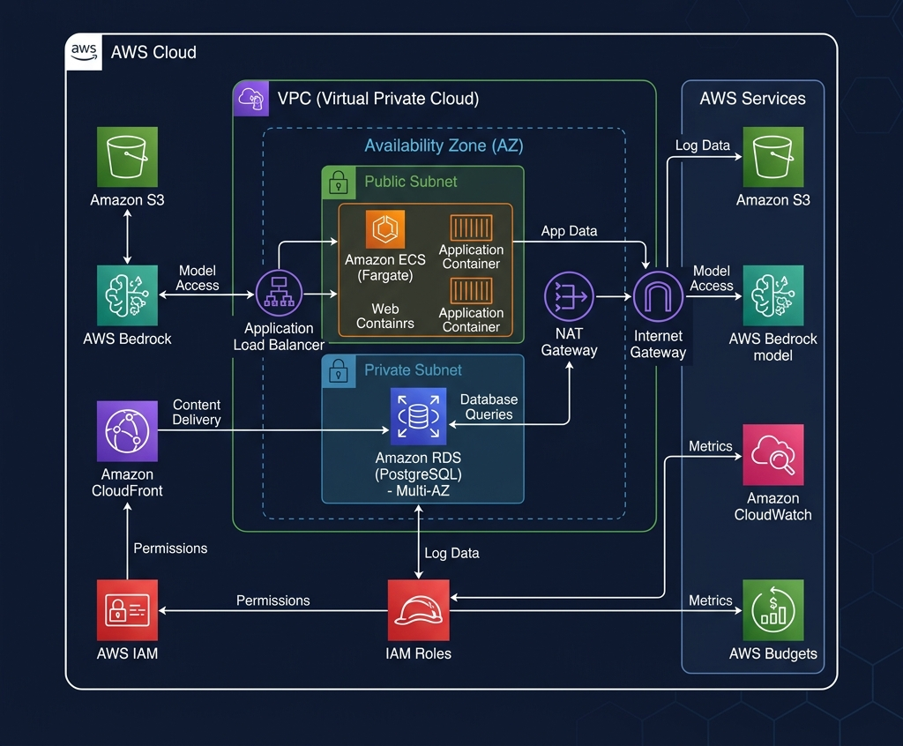

# LogiSim AI: Agent-First Logistics Dispatch & Simulation Sandbox

LogiSim AI is an AI-native, agentic logistics optimization platform. It combines a state-machine-driven event simulator with an LLM-powered dispatch agent to resolve real-world supply chain disruptions (e.g., weather delays, vehicle breakdowns, carrier cancellations) in real-time.

The application contains a robust Python Django API backend, a custom ReAct (Reasoning and Action) agent orchestrator, a local Hybrid-search RAG contract database, and a sleek, glassmorphic React dashboard with interactive Human-in-the-Loop (HITL) manual overrides.

---

## AWS Infrastructure Architecture

Below is the cloud deployment blueprint designed in our Infrastructure-as-Code (Terraform) scripts. It isolates the computing instances, secures database queries, enables serverless container execution, and integrates Bedrock LLMs.



### Infrastructure Breakdown

1. **VPC Networking (`10.0.0.0/16`)**:
   * **Public Subnets**: Provisioned across two Availability Zones (`us-east-1a` & `us-east-1b`) for high availability. These subnet zones host the ECS container instances and handle communication through the Internet Gateway.
   * **Route Tables**: Maps all outbound internet requests (`0.0.0.0/0`) through the Internet Gateway, enabling the ECS containers to download python packages, pull logs, and connect to Bedrock.

2. **Security & Firewalls (Security Groups)**:
   * **ECS Tasks SG**: Allows public ingress strictly on port `8000` (Django REST API) and port `80` (HTTP). Allows unrestricted outbound access.
   * **PostgreSQL RDS SG**: Restricts inbound database queries on port `5432` strictly to traffic coming from the ECS task group. *The database has no public IP and is isolated from the internet.*

3. **Compute & Storage Layer**:
   * **Amazon ECS Fargate**: Serverless orchestration running containerized Django backend nodes. Eliminates the overhead of configuring, patching, and scaling EC2 virtual instances.
   * **Amazon RDS PostgreSQL (`db.t3.micro`)**: Multi-AZ capable database initialized with a 20 GB GP2 SSD. Runs the `pgvector` extension for storing and performing similarity searches on contract embeddings.
   * **Amazon S3**: An asset bucket designed to persist simulation history archives and metrics reports.

4. **Security & Identity (IAM Task Roles)**:
   * **Execution Role**: Used by the Fargate agent to pull images from the ECR registry and publish outputs to CloudWatch logs.
   * **Task Role**: Attached to the active Django container. Grants explicit, credential-free access to query Claude 3.5 Sonnet on **Amazon Bedrock** (`bedrock:InvokeModel`).

5. **AWS Cost Control & Budgets**:
   * **AWS Budgets**: Configured with a monthly spend limit of **$5.00 USD**.
   * **Alert Triggers**: Sends email alerts to `dilukshashamal2001@gmail.com` if actual monthly costs exceed **$4.00 (80%)** or if forecasted charges are projected to exceed **$5.00 (100%)**.

---

## Technical Architecture & Core Pillars

### 1. Hybrid RAG (Retrieval-Augmented Generation)
To prevent the agent from mixing up carrier SLAs or violating transport guidelines, our RAG engine in `backend/rag/vector_store.py` utilizes a multi-stage, high-precision retrieval mechanism:
* **Metadata Pre-filtering**: Before similarity calculations, it filters document chunks strictly by the target `carrier_id`. This prevents cross-carrier SLA contamination.
* **Hybrid Matching**:
  * **Sparse Search (TF-IDF)**: Matches exact keywords (e.g. section numbers, carrier names, numeric values).
  * **Dense Semantic Matching**: Expands search tokens using a synonym dictionary (e.g., matching "engine fire" or "mechanical delay" to "breakdown").
* **Reciprocal Rank Fusion (RRF)**: Merges sparse and semantic rankings using the rank fusion formula:
  \[ RRF\_Score(d) = \sum_{m \in M} \frac{1}{60 + r_m(d)} \]
* **Relevance Guardrail**: Discards any matches below a `0.15` cosine similarity score to prevent the LLM from hallucinating answers based on unrelated text.

### 2. State-Machine Simulator
The simulation engine in `backend/simulator/engine.py` runs a discrete-time clock. On every tick (representing 1 hour):
1. **Shipment Progress**: Moves shipments that are `IN_TRANSIT` based on distance. Delayed shipments move at 50% speed. Upon completion, logs delivery costs and timestamps.
2. **Disruption Injection**: Fires scheduled events (e.g., breakdown at tick 4) which stalls route progression and updates shipment status.
3. **Agent Trigger**: Triggers the AI agent loop to resolve the network issues.
4. **HITL Pause**: If the agent proposes a high-cost or high-risk decision, the simulator halts the clock and prompts a human operator.

### 3. ReAct Agent Loop
The orchestrator in `backend/agents/loop.py` uses a Reasoning and Action loop:
* **Tools**:
  * `query_shipment_details(shipment_id)`
  * `get_available_carriers()`
  * `reassign_carrier(shipment_id, carrier_id)`
  * `query_carrier_contract_sla(query, carrier_id)` (uses the hybrid RAG engine)
  * `request_human_override(shipment_id, reason, proposed_action)` (suspends loop)
  * `resolve_disruption_event(event_id, resolution_details)`
* **Dual Execution Paths**: Connects to Bedrock (Claude 3.5 Sonnet) in production, and defaults to a local rule-based cognitive agent when offline to enable developer testing with zero token costs.

---

## Directory Structure

```text
ifs-logistic/
│
├── backend/                  # Django & Agent System
│   ├── manage.py
│   ├── config/               # Settings, Routing, and URLs
│   ├── logistics/            # DB Models, API views, Serializers, Tests
│   ├── simulator/            # State-machine simulator and scenarios
│   ├── agents/               # ReAct agent loop and tools registry
│   └── rag/                  # Hybrid RAG search engine
│
├── frontend/                 # React SPA Dashboard
│   ├── src/
│   │   ├── App.jsx           # Live map, KPIs, Monologue, and HITL overlays
│   │   └── index.css         # Dark-mode styling, glassmorphism, animations
│   └── package.json
│
├── terraform/                # Infrastructure-as-Code
│   ├── main.tf               # VPC, ECS, RDS, S3, IAM, and Billing Budgets
│   └── variables.tf          # Configurable regions, thresholds, and instance types
│
├── aws_architecture.png      # AWS Technical Architecture Diagram
└── README.md                 # Complete documentation
```

---

## Getting Started

### 1. Prerequisites
* Python 3.11+
* Node.js & npm
* Git

### 2. Backend Installation & Run
From the project root:
```powershell
# Create and activate virtual environment
python -m venv .venv
.\.venv\Scripts\activate

# Install python dependencies
pip install -r backend/requirements.txt

# Run migrations & seed database
cd backend
python manage.py makemigrations logistics
python manage.py migrate

# Start Django development server
python manage.py runserver
```
*Backend API server will run at: [http://localhost:8000/api/](http://localhost:8000/api/)*

### 3. Frontend Installation & Run
Open a second terminal:
```powershell
# Navigate to frontend folder
cd frontend

# Install npm dependencies
npm install

# Start Vite React server
npm run dev
```
*Vite frontend portal will run at: [http://localhost:5173/](http://localhost:5173/)*

### 4. Running the Test Suite
To verify the RAG search matches, simulator clock steps, and agent audit trails, run:
```powershell
cd backend
python manage.py test
```
